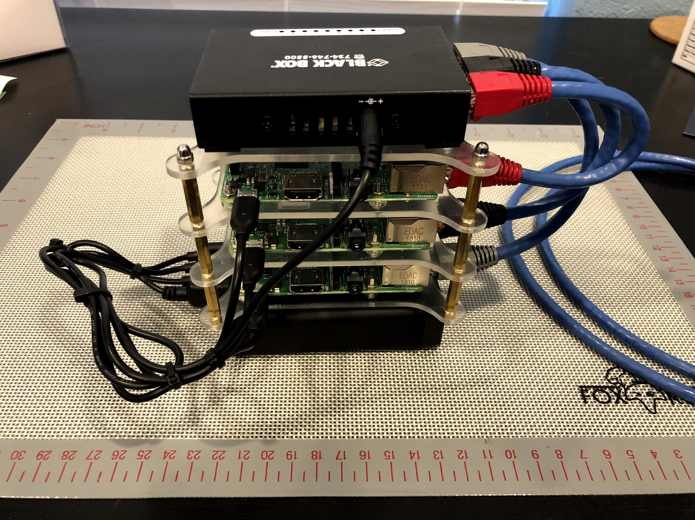
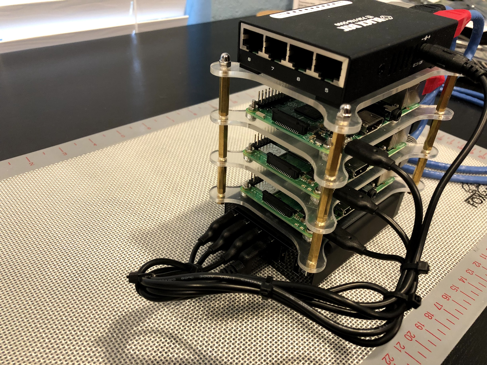
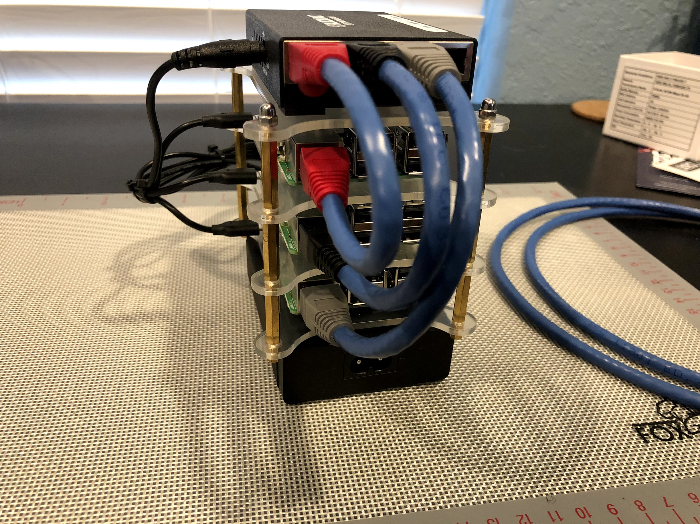

# Raspberry Pi Kubernetes Cluster
>Learning how to create a Kubernetes cluster from scratch with some Raspberry Pis.

* [Hardware Build](#hardware-build)
* [Setup](#setup)
  * [Master Node](#master-node)
* [Reference](#reference)

---

## Hardware Build

This cluster is 3 nodes:





Component | Quantity
--- | ---
[Raspberry Pi 3 Model B+][model-b+] | 2
[Raspberry Pi 3 Model B][model-b] | 1
[Anker PowerPort 6 (60W 6-Port USB Charging Hub)][powerport] | 1
[Black Box USB-Powered 10/100 8-Port Switch][eth-switch] | 1
[32GB Sandisk Ultra microSDHC Card][sandisk] | 3
[Raspberry Pi 3 - 4 Layer Stackable Dob Bone Case][pi-case] | 1
[Cat6 Ethernet Patch Cable][cat6-cable] | 1
[RJ-45 Color Coded Strain Relief Boots][rj45-boots] | 8

### Tools

Component | Quantity
--- | ---
[UbiGear Ethernet Cable Crimper Kit + 100 RJ45][cable-kit] | 1

---

## Setup

>__Note:__ These instructions are for Macs.

* Much of this setup is following the [Kubernetes on Raspbian Lite][k8s-raspbian] guide by [Alex Ellis][alex-ellis].

### Master Node

1. Download [Raspbian Stretch Lite][raspbian-download].
2. Flash SD Card with the unzipped raspbian image.
	[Etcher][etcher] is an open-source [Electron][electron] app for flashing OS
	images to SD cards and USB drives.

	```bash
	brew cask install etcher
	```
3. Enable __ssh__ on the SD card:
	```bash
	touch /Volumes/boot/shh
	```
	* __Note:__ may need to mount the sd card after flashing.
4. SSH in to the Pi directly from Ethernet adapter.
	* [Enable _Internet Sharing_][ssh-mac-ethernet]
	* Raspbian should have [Avahi Daemon][avahi] running, allowing for
	  connection with `raspberrypi.local`:
	```bash
	ping raspberrypi.local
	ssh pi@raspberrypi.local    # default pi password is 'raspberry'
	```
	* if the above doesn't work, look for the ethernet adapter (bridge100) inet address:
	```
	ifconfig

	# install nmap and discover ethernet devices
	brew install nmap
	nmap -n -sn 192.168.2.1/24     # ip address may differ
	ssh pi@192.168.2.2      # ip address may differ
	```

---

## Reference

* [Kubernetes on Raspbian Lite][k8s-raspbian]
* [Headless Raspberry Pi Install][headless-pi]
* [How to SSH into your Raspberry Pi with Mac and Ethernet Cable][ssh-mac-ethernet]

[model-b+]:https://www.raspberrypi.org/products/raspberry-pi-3-model-b-plus/
[model-b]:https://www.raspberrypi.org/products/raspberry-pi-3-model-b/
[powerport]:http://a.co/d/g3Ii5Fr
[eth-switch]:http://a.co/d/9NnN8IS
[sandisk]:http://a.co/d/eC8fl8z
[pi-case]:http://a.co/d/gyPpKsa
[cat6-cable]:http://a.co/d/gOTcmWo
[rj45-boots]: http://a.co/d/ieb0iN0
[cable-kit]:http://a.co/d/jc7bpds
[alex-ellis]:https://gist.github.com/alexellis
[etcher]:https://etcher.io/
[electron]:https://electronjs.org/
[raspbian-download]:https://downloads.raspberrypi.org/raspbian_lite_latest
[avahi]:https://linux.die.net/man/8/avahi-daemon

[k8s-raspbian]:https://gist.github.com/alexellis/fdbc90de7691a1b9edb545c17da2d975
[headlaess-pi]:https://hackernoon.com/raspberry-pi-headless-install-462ccabd75d0
[ssh-mac-ethernet]:https://medium.com/@tzhenghao/how-to-ssh-into-your-raspberry-pi-with-a-mac-and-ethernet-cable-636a197d055
